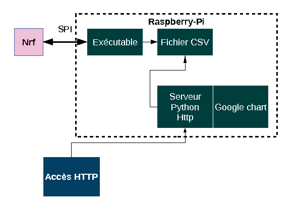

Compte-rendu Projet Peri  
Mendy Alexandre  
Faure Calixte  

# Arduino


On Modifie le programme du TP5 pour afficher les valeurs issues du capteur NRF toutes les 1.5 secondes.
On conserve le gestion du passage de donnée par boite à lettre entre la Photo-resistannce et le capteur NRF.

Afin de faire fonctionner le capteur NRF on ajoute les definitions issus du fichier d'exemple fournit dans le sujet du TP5 capteur NRF

```c
//:::: Variable Global du module NRF ::::
RF24 radio(9,10);   
byte addresses[][6] = {"50000"};
char mess[16];
char buffer[32];
unsigned long timer;

//:::: NRF Setup ::::
void setup_nrf() {
  radio.begin();  
  radio.setPALevel(RF24_PA_LOW);
  radio.openWritingPipe(addresses[0]);
  radio.printDetails();}

//Permet d'envoyer une donné au module NRF24
void NRF_write( char* buf_NRF) {
  sprintf(buffer,"%s", buf_NRF);
  radio.write( &buffer, sizeof(buffer) );
  timer++;  
  Serial.println(buffer);}
```
La tache T1 effectue une mise à jour de la boite à lettre si elle est à l'état vide.
La mise à jour consiste à copier la valeur de la broche analog 15 dans mb->val et mettre mb->etat à l'état *Full*.
L'execution d ela tache T1 est conditionnée par une temporisation gerer par un timer (numero 4) dont on passe la valeur en argumentn on initialise dans le setup une tempo de 1 000 000 soit environ 1s.

```c
void loop_T1(struct Mess_st *ctx, struct mailbox *mb, char* bufPR) {
  if (!(waitFor(ctx->timer,ctx->period))) return;         // sort s'il y a moins d'une période écoulée     
  if (mb->state != EMPTY) return; // attend que la mailbox soit vide
  mb->val  = analogRead(15); // read the input pin  
  mb->state = FULL;
}
```

La tache T2 effectue une écriture vers le module NRF24 à chaque lecture de la structure boite à lettre "void loop_T2" (On envoie la variable  "mb->val").
Après chaque passage dans la T2 de la boite à lettre, on la remet à l'etat "empty" afin d'autoriser le passage dans la tache T1. *Il est à noter que la tache T2 n'est pas temporisée.*

Il est nécessaire de passer le pointeur BufPR à T2 qui contient la dernière valeur lue de la Photo-Resistance.
Cette valeur est ensuite passée à la fonction *NRF_write(bufPR)* qui se charge d'envoyerla valeur via le protocol SPI au capteur NRF.

```c
void loop_T2(struct mailbox *mb, char* bufPR) {
  if (mb->state != FULL) return; // attend que la mailbox soit pleine
  sprintf(bufPR, "%d", mb->val);  //Converti la valeur decimal en caractere
  display.println("Valeur Photo-Resistance:");
  display.println(bufPR);   // chargement du message sur l'écran console
  display.display();        // affichage du message sur l'écran console
  display.clearDisplay();
  display.setCursor(0,0);
  NRF_write(bufPR);	 //On envoie la valeur du capteur NRF vers la photo_res
  mb->state = EMPTY; //On re autorise l'ecriture dans la boite à lettre.
}
```
La boucle principale ne fait qu'appeler les Tache T1 et T2.

### Bonus
Nous avons aussi pu expérimenter avec notre propre matériel !

# Raspberry

## Capteur NRF et application
Nous avons une application `nrf_reader` qui s'occupe de lire
la valeur du capteur NRF toutes les secondes et les écrit dans
un fichier csv avec la date.
La première valeur captée est fausse, nous n'écrivons donc
qu'à partir de la deuxième valeur.

## Serveur HTTP en Python
Le serveur va s'occuper de lire et *parser* le fichier CSV pour
l'afficher grâce à l'API Google Charts. Il convertit également
la date epoch en date lisible par un humain.
Nous avons implémenter une fonction permettant à l'utilisateur
de choisir le nombre de données à afficher.
